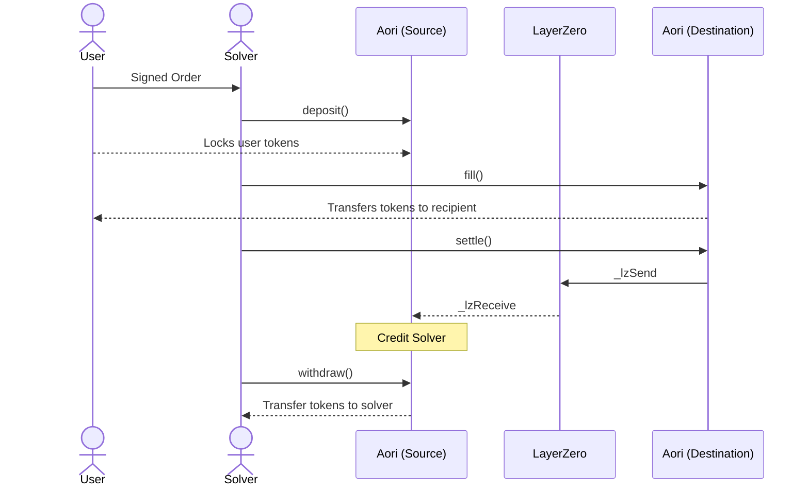
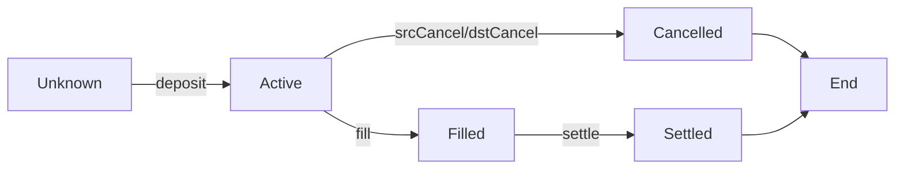
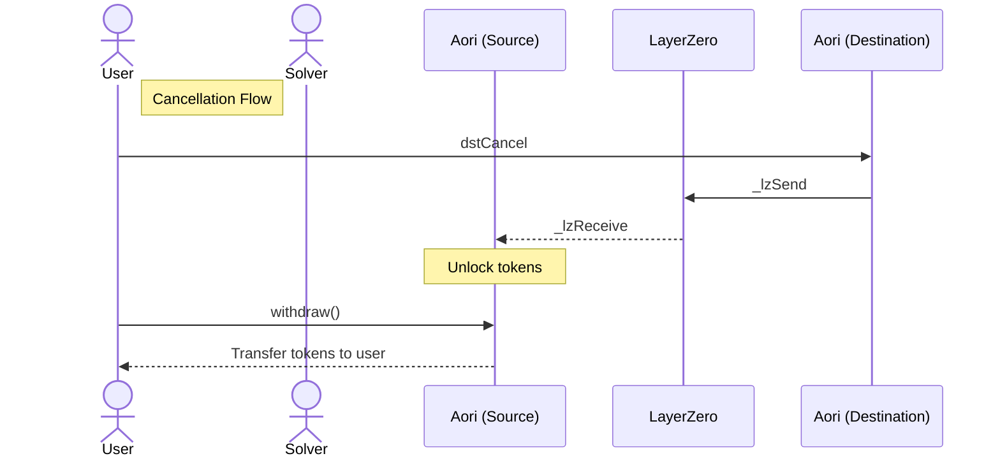

#### Aori is designed to securely facilitate performant cross chain trading, with trust minimized settlement. To accomplish this, Aori uses a combination of off-chain infrastucture, on-chain settlement contracts, and Layer Zero messaging.

#### Solvers can expose a simple API to ingest and process orderflow directly to their trading system. The Aori smart contracts ensure that the user's intents are satisfied by the Solver on the destination chain according to the parameters of an intent on the source chain, signed by the user.

## Protocol Architecture

###### The Aori protocol consists of paired smart contracts deployed on different blockchains, enabling secure cross-chain intent settlement through LayerZero's messaging infrastructure.



## Core Contract Components

### Order

###### The Aori contract revolves around a central `Order` struct that contains all parameters needed to fulfill a user's cross-chain intent:

```solidity
struct Order {
    uint128 inputAmount;      // Amount of tokens to be sent
    uint128 outputAmount;     // Amount of tokens to be received
    address inputToken;       // Token address on source chain
    address outputToken;      // Token address on destination chain
    uint32 startTime;         // When the order becomes valid
    uint32 endTime;           // When the order expires
    uint32 srcEid;            // Source chain endpoint ID
    uint32 dstEid;            // Destination chain endpoint ID
    address offerer;          // User who created the order
    address recipient;        // Address to receive output tokens
}
```

### Order Lifecycle

###### An order moves through various status states as it progresses through the settlement process:



#### Deposit & Fill Process

###### 1. User signs an order with EIP-712 signature
###### 2. Solver submits the order and signature to source chain
###### 3. Tokens are locked in the source chain contract
###### 4. Solver fulfills the order on the destination chain
###### 5. Tokens are transferred to the recipient on destination chain
###### 6. Settlement message is sent back to source chain
###### 7. Source chain transfers locked tokens to solver

#### Cancellation Process

Aori supports two types of cancellation:

###### 1. Source Cancellation: Solvers can cancel directly on source chain
###### 2. Destination Cancellation: After expiry, users or solvers can cancel from destination chain, which sends a message to source chain and confirms the order has not been filled.



#### Settlement Process

###### 1. Fill Recording: When orders are filled on destination chain, they're stored in the solver's fill array.
###### 2. Batch Settlement: Solvers can batch up to MAX_FILLS_PER_SETTLE orders for efficient processing.
###### 3. Cross-Chain Message: A settlement payload containing filler address and order hashes is sent via LayerZero.
###### 4. Source Chain Processing: The source chain:
###### 5. Validates orders are in Active state
###### 6. Transfers tokens from locked to unlocked state for the solver
###### 7. Marks orders as Settled
###### 8. Skips problematic orders without reverting the entire batch
###### 9. Events: Emits Settle events for successful settlements.

This design ensures efficient, secure settlement while gracefully handling partial failures.

---

# Developers

## Getting Started

#### Installing dependencies

```bash
pnpm install
```

#### Compiling your contracts

```bash
forge build
```

#### Running tests

```bash
forge test
```

## Deploying Contracts

Set up deployer wallet/account:

- Rename `.env.example` -> `.env`
- Choose your preferred means of setting up your deployer wallet/account:

```
MNEMONIC="test test test test test test test test test test test junk"
or...
PRIVATE_KEY="0xabc...def"
```

To deploy your contracts to your desired blockchains, run the following command in your project's folder:

```bash
npx hardhat lz:deploy
```

More information about available CLI arguments can be found using the `--help` flag:

```bash
npx hardhat lz:deploy --help
```

## Configuring Contracts

Wire your deployed contracts by running:

```bash
npx hardhat lz:oapp:wire --oapp-config layerzero.config.ts
```

## Coverage Report

See code test coverage

```bash
forge coverage --report --ir-minimum
```

## Deterministic Multi-Chain Deployments

The Aori contracts support deterministic deployments across multiple chains, allowing you to deploy contracts to the same address on different networks. This simplifies cross-chain integration as users and integrators can use the same contract address regardless of the chain.

### Method 1: Nonce Management

This approach ensures your deployer has the same nonce across all chains:

1. Check nonces across networks:
```bash
npx hardhat run scripts/checkNonces.ts
```

2. Align nonces using dummy transactions:
```bash
npx hardhat run scripts/setNonces.ts
```

3. Deploy with deterministic flag:
```bash
npx hardhat deploy --tags deterministic --network <network-name>
```

### Method 2: CREATE2 Factory (Recommended)

The CREATE2 approach is more robust and doesn't depend on nonce management:

1. Deploy the factory to each network:
```bash
npx hardhat deploy --tags factory --network <network-name>
```

2. Deploy Aori contracts using CREATE2:
```bash
npx hardhat deploy --tags create2 --network <network-name>
```

After deploying to all networks, wire the contracts together:
```bash
npx hardhat lz:oapp:wire --oapp-config layerzero.config.ts
```

## License

MIT
