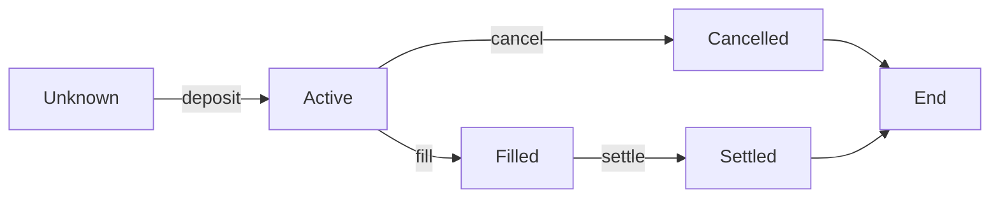
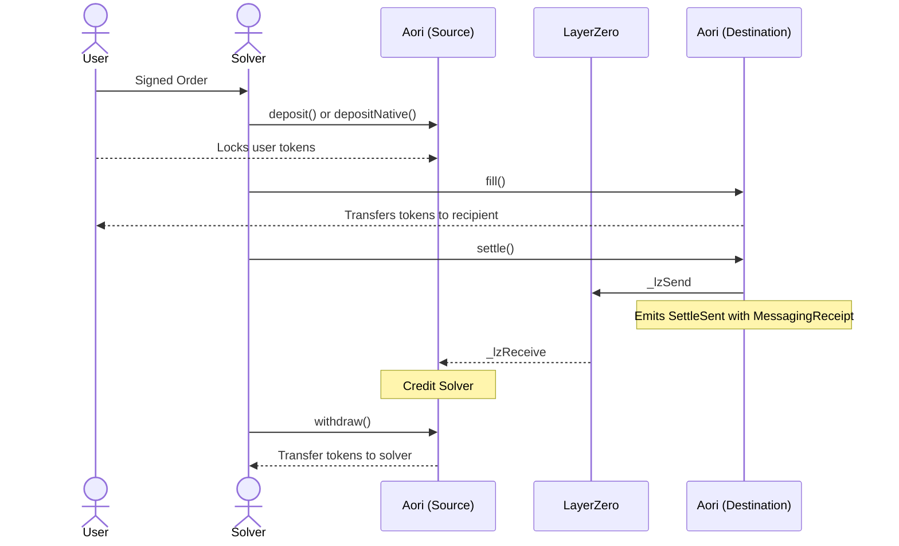
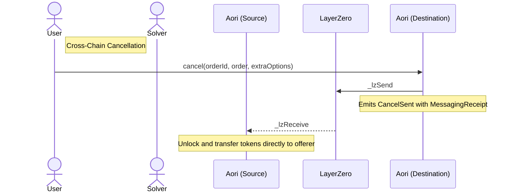
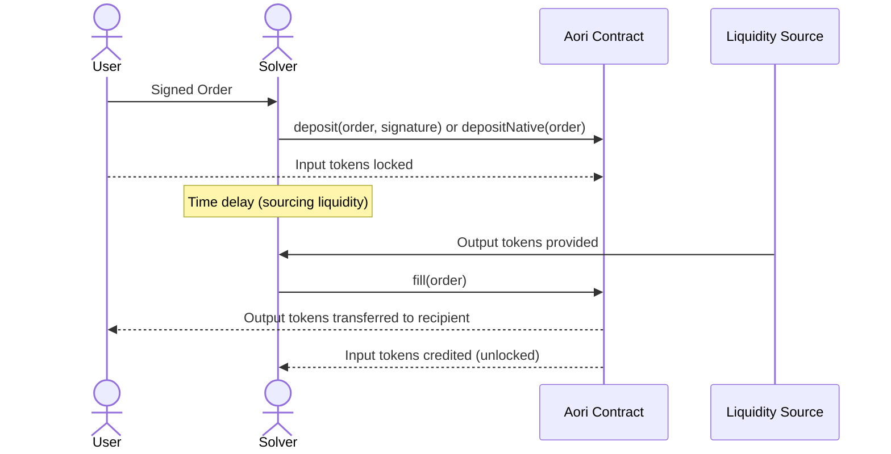
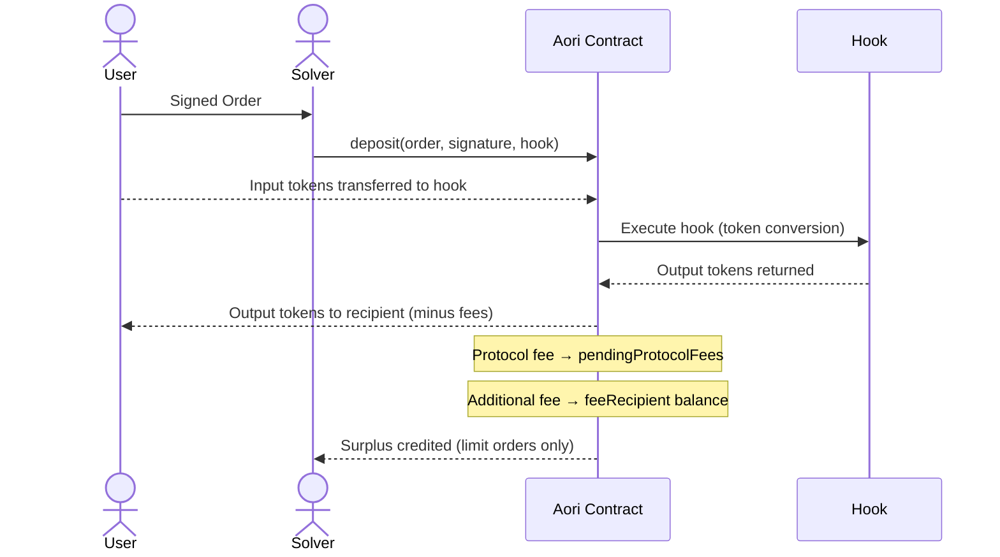

<div align="center">
  
</div>

---

Aori is designed to securely facilitate omnichain trading, with low latency execution, and trust minimized settlement. To accomplish this, Aori uses a combination of off-chain infrastructure, on-chain settlement contracts, and LayerZero messaging.

Solvers can expose a simple API to ingest and process orderflow directly to their trading system. The Aori Protocol's smart contracts ensure that the user's intents are satisfied by the Solver on the destination chain according to the parameters of a user signed intent submitted on the source chain.

## Core Contract Components

### Order

The Aori contract revolves around a central `Order` struct that contains all parameters needed to fulfill a user's cross-chain intent:

```solidity
struct Order {
    uint128 inputAmount;      // Amount of tokens to be sent
    uint128 outputAmount;     // Amount of tokens to be received
    address inputToken;       // Token address on source chain
    address outputToken;      // Token address on destination chain
    uint32 startTime;         // When the order becomes valid
    uint32 endTime;           // When the order expires
    uint32 srcEid;            // Source chain endpoint ID
    uint32 dstEid;            // Destination chain endpoint ID
    address offerer;          // User who created the order
    address recipient;        // Address to receive output tokens
    Options options;          // User-signed order configuration
}
```

### Options

The `Options` struct is nested inside `Order` and signed by the user, giving them explicit control over fee configuration, solver binding, and order type:

```solidity
struct Options {
    uint16 feeMbps;        // Fee in millibasis points (1000 = 1%)
    address feeRecipient;  // Who receives the fee (address(0) = solver)
    address solver;        // Authorized solver (address(0) = any whitelisted)
    uint16 slippageMbps;   // 0 = limit order, >0 = market order
}
```

- **`solver`** — If set, only this solver can deposit/fill the order. If `address(0)`, any whitelisted solver can.
- **`feeMbps`** — An additional fee the user agrees to pay, capped by the protocol's `maxFeeMbps`.
- **`feeRecipient`** — Where the additional fee goes. `address(0)` routes it to the solver.
- **`slippageMbps`** — Determines the order type and surplus routing (see [Order Types](#order-types--slippage) below).

### Native Token Support

The protocol supports both ERC-20 tokens and native tokens (ETH/native chain currency). Native tokens are represented by the address `0xEeeeeEeeeEeEeeEeEeEeeEEEeeeeEeeeeeeeEEeE` and can be deposited using `depositNative()`. The `TokenUtils` library abstracts the handling of transfers and balance observations for both token types.

### Permit2 Support

Users can deposit via [Permit2](https://github.com/Uniswap/permit2) witness-based signatures using `depositWithPermit2()`. The `Order` struct serves as the Permit2 witness, binding the token transfer authorization to the specific order in a single signature — eliminating the need for a separate ERC-20 `approve` transaction.

### Order Lifecycle

An order moves through various status states as it progresses through the settlement process:


```mermaid
flowchart LR
    Unknown -->|deposit| Active
    Active -->|fill| Filled
    Active -->|cancel| Cancelled
    Filled -->|settle| Settled
    Cancelled --> End
    Settled --> End
```

## Cross Chain Architecture

The Aori protocol consists of paired smart contracts deployed on different blockchains, enabling secure cross-chain intent settlement through LayerZero's messaging infrastructure.


```mermaid
sequenceDiagram
    actor User
    actor Solver
    participant AoriSrc as Aori (Source)
    participant LZ as LayerZero
    participant AoriDst as Aori (Destination)

    %% Order Fill Flow
    User->>Solver: Signed Order
    Solver->>AoriSrc: deposit() or depositNative()
    User-->>AoriSrc: Locks user tokens
    Solver->>AoriDst: fill()
    AoriDst-->>User: Transfers tokens to recipient
    Solver->>AoriDst: settle()
    AoriDst->>LZ: _lzSend
    Note over AoriDst: Emits SettleSent with MessagingReceipt
    LZ-->>AoriSrc: _lzReceive
    Note over AoriSrc: Credit Solver
    Solver->>AoriSrc: withdraw()
    AoriSrc-->>Solver: Transfer tokens to solver
```

#### Deposit & Fill Process

1. User signs an order with EIP-712 signature (includes `Options` for fee/solver/slippage configuration)
2. Solver submits the order and signature to source chain using `deposit()` for ERC-20 tokens, `depositNative()` for native tokens, or `depositWithPermit2()` for gasless approval
3. If `order.options.solver` is set, only that solver can submit the deposit/fill
4. Tokens are locked in the source chain contract
5. Solver fulfills the order on the destination chain
6. Tokens are transferred to the recipient on destination chain
7. Settlement message is sent back to source chain (with MessagingReceipt data captured in events)
8. Source chain deducts fees (protocol + additional) and transfers remaining locked tokens to solver

#### Cancellation Process

**Important**: Cross-chain order cancellation has been updated for security. All cross-chain order cancellations must now go through the destination chain to prevent race conditions with settlement messages.

**Cross-Chain Orders**:
- Must be cancelled from destination chain only
- Permitted cancellers: whitelisted solvers (anytime), order offerers (after expiry), or order recipients (after expiry)
- Sends cancellation message to source chain via LayerZero
- Automatically transfers tokens back to offerer (no separate withdraw needed)

**Single-Chain Orders**:
- Can be cancelled directly on source chain
- Permitted cancellers: whitelisted solvers (anytime), order offerers (after expiry)


```mermaid
sequenceDiagram
    actor User
    actor Solver
    participant AoriSrc as Aori (Source)
    participant LZ as LayerZero
    participant AoriDst as Aori (Destination)

    %% Cross-Chain Cancellation Flow
    note right of User: Cross-Chain Cancellation
    User->>AoriDst: cancel(orderId, order, extraOptions)
    AoriDst->>LZ: _lzSend
    Note over AoriDst: Emits CancelSent with MessagingReceipt
    LZ-->>AoriSrc: _lzReceive
    Note over AoriSrc: Unlock and transfer tokens directly to offerer
```

#### Settlement Process

1. Fill Recording: When orders are filled on destination chain, they're stored in the solver's fill array.
2. Batch Settlement: Solvers can batch up to `maxFillsPerSettle` orders for efficient processing.
3. Cross-Chain Message: A settlement payload containing filler address and order hashes is sent via LayerZero.
4. Receipt Tracking: MessagingReceipt information (guid, nonce, fee) is captured and included in the SettleSent event.
5. Source Chain Processing: The source chain:
   - Validates orders are in Active state
   - Calculates protocol fee and additional fee from the locked amount
   - Credits solver with `inputAmount - protocolFee - additionalFee`
   - Accrues protocol fee to `pendingProtocolFees` (lazy accrual)
   - Credits additional fee to `feeRecipient` balance
   - Marks orders as Settled
   - Skips problematic orders via soft-fail rollback without reverting the entire batch
6. Events: Emits `Settle` events with fee breakdown for successful settlements, `SettleFailed` for skipped orders.

This design ensures efficient, secure settlement while gracefully handling partial failures.

## Single-Chain Swap Architecture

Single-chain swap orders are also supported by Aori.sol. These orders bypass the complex cross-chain messaging and offer efficient peer to peer settlement. The contract supports three main fulfillment paths for single-chain swaps:

#### Delayed Fulfillment via deposit then fill


```mermaid
sequenceDiagram
    actor User
    actor Solver
    participant Aori as Aori Contract
    participant LiqSrc as Liquidity Source

    User->>Solver: Signed Order
    Solver->>Aori: deposit(order, signature) or depositNative(order)
    User-->>Aori: Input tokens locked
    Note over Solver: Time delay (sourcing liquidity)
    LiqSrc->>Solver: Output tokens provided
    Solver->>Aori: fill(order)
    Aori-->>User: Output tokens transferred to recipient
    Aori-->>Solver: Input tokens credited (unlocked)
```

In this two-step flow:
1. Solver first calls `deposit()` with the user's signed order (or user calls `depositNative()` for ETH)
2. Input tokens are transferred from the user and locked in the contract
3. Order is marked as Active
4. Later, when the solver has sourced the output tokens (from a DEX or other liquidity source)
5. Solver calls `fill()` with the same order
6. Output tokens are transferred from the solver to the recipient
7. Order is immediately settled, and input tokens are credited to the solver

This pattern gives solvers flexibility to lock in the user's intent first, then source the output tokens before completing the trade. The settlement happens immediately after the fill call without needing cross-chain messaging.

#### Atomic Swap via Deposit with Hook

The contract supports a hook-based deposit mechanism for single-chain swaps that settles atomically with fee distribution:


```mermaid
sequenceDiagram
    actor User
    actor Solver
    participant Aori as Aori Contract
    participant Hook as Hook

    User->>Solver: Signed Order
    Solver->>Aori: deposit(order, signature, hook)
    User-->>Aori: Input tokens transferred to hook
    Aori->>Hook: Execute hook (token conversion)
    Hook-->>Aori: Output tokens returned
    Aori-->>User: Output tokens to recipient (minus fees)
    Note over Aori: Protocol fee → pendingProtocolFees
    Note over Aori: Additional fee → feeRecipient balance
    Aori-->>Solver: Surplus credited (limit orders only)
```

In this path:
1. Solver calls `deposit()` with the user's order, signature, and hook configuration
2. Input tokens are transferred directly to the hook contract
3. The hook executes a route (e.g. DEX swap)
4. Output tokens are returned to the Aori contract
5. Output is validated against `minOutput` (slippage protection)
6. Fees are deducted and distributed (protocol fee + additional fee)
7. Recipient receives output minus fees
8. For limit orders (`slippageMbps = 0`), surplus goes to solver
9. Order is marked as Settled in a single transaction

This pattern enables advanced liquidity sourcing directly within the transaction.

## Order Types & Slippage

The `slippageMbps` field in `Options` determines order type and who captures price improvement (surplus):

| `slippageMbps` | Order Type | Surplus Goes To | Minimum Output |
|---|---|---|---|
| `0` | Limit | Solver | `outputAmount` (exact) |
| `> 0` | Market | Recipient | `outputAmount × (1 - slippage%)` |

**Limit orders** (`slippageMbps = 0`) — The solver must deliver at least `outputAmount`. Any surplus from execution efficiency is captured by the solver as profit.

**Market orders** (`slippageMbps > 0`) — The recipient captures all price improvement. The solver is compensated via fees instead. The minimum acceptable output is:

```
minOutput = outputAmount × (100000 - slippageMbps) / 100000
```

Solvers cannot tamper with `slippageMbps` because the `orderId` is derived from `keccak256(abi.encode(order))` — modifying any field changes the hash, and settlement will fail since the source chain won't find the original order.

## Fee System

Aori uses a dual-fee system with **protocol fees** (governance-controlled) and **additional fees** (user-signed):

| Fee | Set By | Recipient | Limit |
|---|---|---|---|
| **Protocol Fee** | Governance (`setProtocolFee`) | `protocolTreasury` | Cross-validated with `maxFeeMbps` |
| **Additional Fee** | User (signed `order.options.feeMbps`) | `feeRecipient` (or solver if `address(0)`) | Capped by `maxFeeMbps` |

Both fees are deducted from the basis amount. The fee token depends on the execution path:

| Path | Fee Token | Collection Point |
|---|---|---|
| Atomic swap (deposit with hook, single-chain) | `outputToken` | At swap execution |
| Deposit → fill → settle | `inputToken` | At settlement |

**Key design decisions:**
- Fees and surplus accrue to internal `unlocked` balances rather than immediate transfers (~21,000 gas saved per avoided transfer)
- Protocol fees use lazy accrual (`pendingProtocolFees[token]`) — `claimProtocolFees()` is permissionless (funds always go to treasury)
- `setProtocolFee` and `setMaxFee` cross-validate: combined fees can never exceed 100%
- Settlement uses soft-fail with rollback to prevent one bad order from blocking a batch


---

# Developers

## Getting Started

#### Installing dependencies

```bash
pnpm install
```

#### Compiling your contracts

```bash
forge build
```

#### Running tests

```bash
forge test
```

## Coverage Report

See code test coverage

```bash
forge coverage --report --ir-minimum
```

## License

MIT
