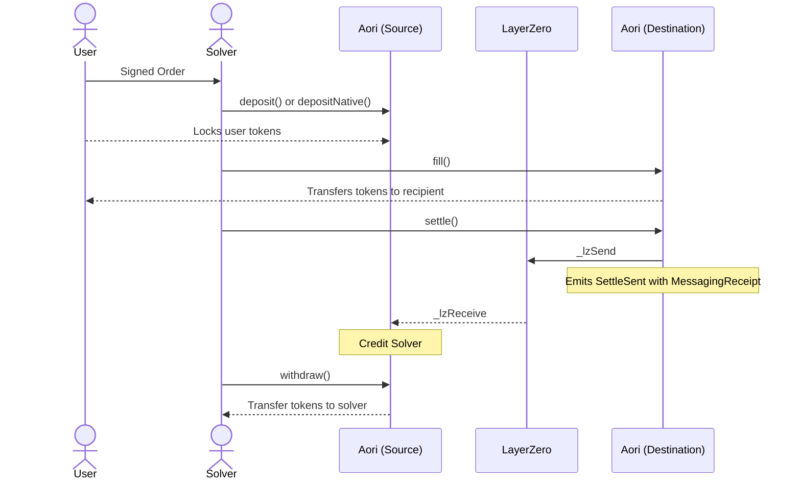
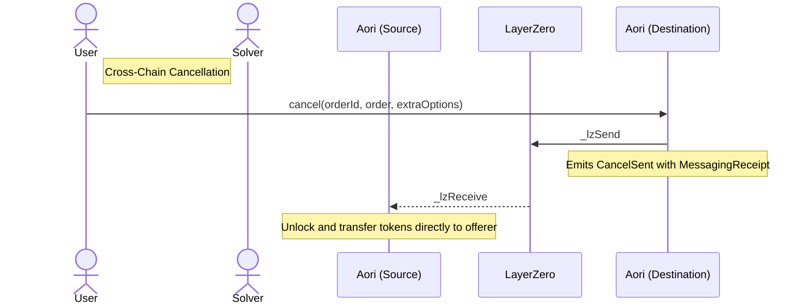
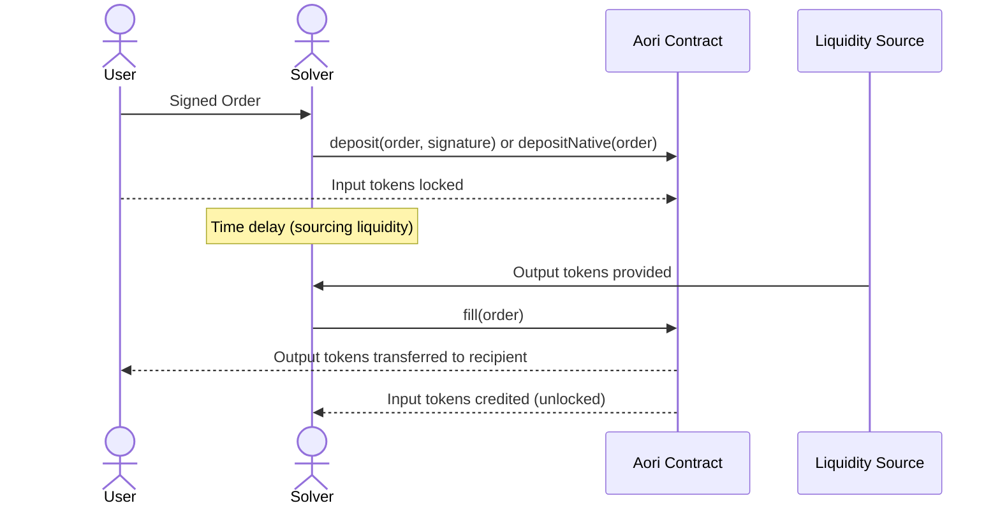

<div align="center">
  
</div>

> ### The Aori protocol is currently in closed beta 
>The Aori Protocol is currently in closed beta and undergoing extensive security audits. A preliminary audit has been completed, with follow-up audits in progress to ensure protocol stability before stable release.
>
> Interested in beta testing? [Contact us](https://aori.io/contact)

---

Aori is designed to securely facilitate omnichain trading, with low latency execution, and trust minimized settlement. To accomplish this, Aori uses a combination of off-chain infrastructure, on-chain settlement contracts, and LayerZero messaging.

Solvers can expose a simple API to ingest and process orderflow directly to their trading system. The Aori Protocol's smart contracts ensure that the user's intents are satisfied by the Solver on the destination chain according to the parameters of a user signed intent submitted on the source chain.

## Core Contract Components

### Order

The Aori contract revolves around a central `Order` struct that contains all parameters needed to fulfill a user's cross-chain intent:

```solidity
struct Order {
    uint128 inputAmount;      // Amount of tokens to be sent
    uint128 outputAmount;     // Amount of tokens to be received
    address inputToken;       // Token address on source chain
    address outputToken;      // Token address on destination chain
    uint32 startTime;         // When the order becomes valid
    uint32 endTime;           // When the order expires
    uint32 srcEid;            // Source chain endpoint ID
    uint32 dstEid;            // Destination chain endpoint ID
    address offerer;          // User who created the order
    address recipient;        // Address to receive output tokens
}
```

### Native Token Support

The protocol supports both ERC-20 tokens and native tokens (ETH/native chain currency). Native tokens are represented by the address `0xEeeeeEeeeEeEeeEeEeEeeEEEeeeeEeeeeeeeEEeE` and can be deposited using the `depositNative()` function. The `NativeTokenUtils` library abstracts the handling of transfers and balance observations for both token types.

### Order Lifecycle

An order moves through various status states as it progresses through the settlement process:


## Cross Chain Architecture

The Aori protocol consists of paired smart contracts deployed on different blockchains, enabling secure cross-chain intent settlement through LayerZero's messaging infrastructure.



#### Deposit & Fill Process

1. User signs an order with EIP-712 signature
2. Solver submits the order and signature to source chain using `deposit()` for ERC-20 tokens
3. For native tokens, users call `depositNative()` directly with ETH sent via `msg.value`
4. Tokens are locked in the source chain contract
5. Solver fulfills the order on the destination chain
6. Tokens are transferred to the recipient on destination chain
7. Settlement message is sent back to source chain (with MessagingReceipt data captured in events)
8. Source chain transfers locked tokens to solver

#### Cancellation Process

**Important**: Cross-chain order cancellation has been updated for security. All cross-chain order cancellations must now go through the destination chain to prevent race conditions with settlement messages.

**Cross-Chain Orders**:
- Must be cancelled from destination chain only
- Permitted cancellers: whitelisted solvers (anytime), order offerers (after expiry), or order recipients (after expiry)
- Sends cancellation message to source chain via LayerZero
- Automatically transfers tokens back to offerer (no separate withdraw needed)

**Single-Chain Orders**:
- Can be cancelled directly on source chain
- Permitted cancellers: whitelisted solvers (anytime), order offerers (after expiry)



#### Settlement Process

1. Fill Recording: When orders are filled on destination chain, they're stored in the solver's fill array.
2. Batch Settlement: Solvers can batch up to MAX_FILLS_PER_SETTLE orders for efficient processing.
3. Cross-Chain Message: A settlement payload containing filler address and order hashes is sent via LayerZero.
4. Receipt Tracking: MessagingReceipt information (guid, nonce, fee) is captured and included in the SettleSent event.
5. Source Chain Processing: The source chain:
   - Validates orders are in Active state
   - Transfers tokens from locked to unlocked state for the solver
   - Marks orders as Settled
   - Skips problematic orders without reverting the entire batch
6. Events: Emits Settle events for successful settlements.

This design ensures efficient, secure settlement while gracefully handling partial failures.

## Single-Chain Swap Architecture

Single-chain swap orders are also supported by Aori.sol. These orders bypass the complex cross-chain messaging and offer efficient peer to peer settlement. The contract supports three main fulfillment paths for single-chain swaps:

#### Immediate Fulfillment via `swap`


In this atomic flow:
1. Solver calls `swap()` with the user's signed order
2. Input tokens are transferred from the user to the contract
3. Output tokens are transferred from the solver to the recipient
4. Input tokens are immediately credited to the solver (unlocked balance)
5. Order is marked as Settled in a single transaction

This is the most gas-efficient path but requires the solver to already have the output tokens.

#### Delayed Fulfillment via deposit then fill



In this two-step flow:
1. Solver first calls `deposit()` with the user's signed order (or user calls `depositNative()` for ETH)
2. Input tokens are transferred from the user and locked in the contract
3. Order is marked as Active
4. Later, when the solver has sourced the output tokens (from a DEX or other liquidity source)
5. Solver calls `fill()` with the same order
6. Output tokens are transferred from the solver to the recipient
7. Order is immediately settled, and input tokens are credited to the solver

This pattern gives solvers flexibility to lock in the user's intent first, then source the output tokens before completing the trade. The settlement happens immediately after the fill call without needing cross-chain messaging.

#### Deposit with Hook Path

The contract also supports a hook-based deposit mechanism for single-chain swaps:


In this path:
1. Solver calls `deposit()` with the user's order, signature, and hook configuration
2. Input tokens are transferred directly to the hook contract
3. The hook executes a route
4. Output tokens are returned to the Aori contract
5. Output tokens are transferred to the recipient
6. Settlement happens immediately, crediting the input amount to the solver

This pattern enables advanced liquidity sourcing directly within the transaction.

---

# Developers

## Getting Started

#### Installing dependencies

```bash
pnpm install
```

#### Compiling your contracts

```bash
forge build
```

#### Running tests

```bash
forge test
```

## Coverage Report

See code test coverage

```bash
forge coverage --report --ir-minimum
```

## License

MIT
